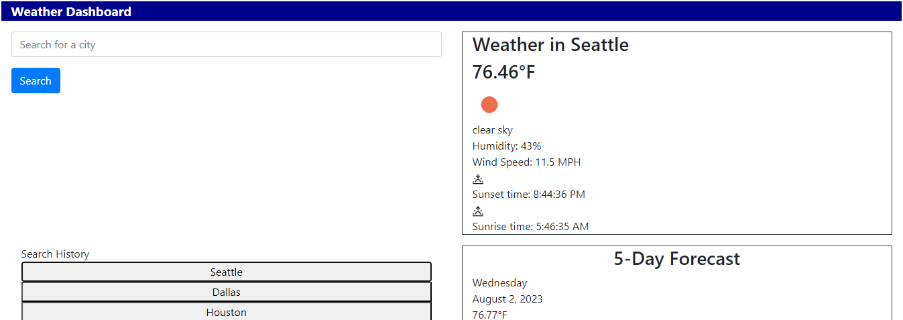

# Weather Dashboard

## Description

A weather dashboard app that allows a user to see weather forecast in their desired cities.  The dashboard displays the current weather as well as the next 5 days, so that the user can plan a trip accordingly.

## Image

## Credits

Partial code for current weather and localstorage used from team project with Jarely Garfias-Rojas, Melissa Kalish and Cristina Nevelits.

OpenWeather API for weather data (https://openweathermap.org/api)

## Link

Link to deployed project: https://openweathermap.org/api